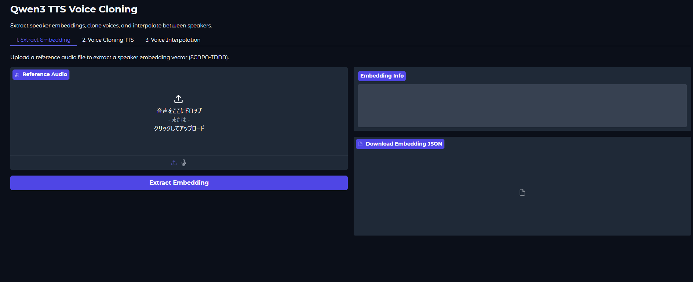

# nn-g2p-unity

Unity 上で日本語 G2P（Grapheme-to-Phoneme）推論を実行する OSS プロジェクトです。  
入力テキストから `phones`（音素列）と `prosody`（韻律記号列）を推論します。

## Demo

## Features

- 日本語 G2P 推論（`phones` / `prosody`）
- AR（Autoregressive）推論のみ対応
- TextMeshPro + IME による日本語入力対応
- サンプルシーンで即時実行可能
- GPU 数値異常検知時の自動 CPU フォールバック

## Runtime Scope

- モデル: `ayousanz/nn-g2p-jp`（`ja_m9`）
- 推論モード: AR のみ（CTC は削除済み）
- 想定入力: 日本語
- デフォルト入力: `こんにちは、今日はいい天気ですね`

## Requirements

- Unity: `6000.3.6f1`
- Packages:
  - `com.unity.sentis: 2.5.0`
  - `com.unity.ugui: 2.0.0`
  - `com.unity.inputsystem: 1.18.0`
- 実行時 API: `Unity.InferenceEngine`（Unity 6000 系）

## Quick Start

1. このリポジトリを clone
2. Unity でプロジェクトを開く
3. `Assets/Scenes/NnG2pSampleScene.unity` を開く
4. Play 実行
5. 入力欄に日本語文を入れて `Run AR` を押す

## Model Files

- ONNX:
  - `Assets/NNG2P/Models/encoder.onnx`
  - `Assets/NNG2P/Models/decoder_step.onnx`
- Vocab:
  - `Assets/StreamingAssets/nn-g2p/vocab/ja_grapheme_m4.txt`
  - `Assets/StreamingAssets/nn-g2p/vocab/ja_phones_m8.txt`
  - `Assets/StreamingAssets/nn-g2p/vocab/ja_prosody_or_stress_m8.txt`
- Meta:
  - `Assets/StreamingAssets/nn-g2p/model_meta.json`

モデル更新が必要な場合は、`ayousanz/nn-g2p-jp` から ONNX / vocab を取得し、
`Assets/StreamingAssets/nn-g2p` と `Assets/NNG2P/Models` を手動で差し替えてください。

## Known Limitations

- 現在の同梱モデルは日本語前提です（英語品質は保証しません）。
- GPU backend で NaN が発生する既知ケースがあり、実装は自動で CPU にフォールバックします。
- ビルド時のサンプル起動には `ProjectSettings/EditorBuildSettings.asset` で
  `Assets/Scenes/NnG2pSampleScene.unity` を含めてください。

## License

Apache License 2.0 (`Apache-2.0`)  
Copyright 2026 ayutaz
